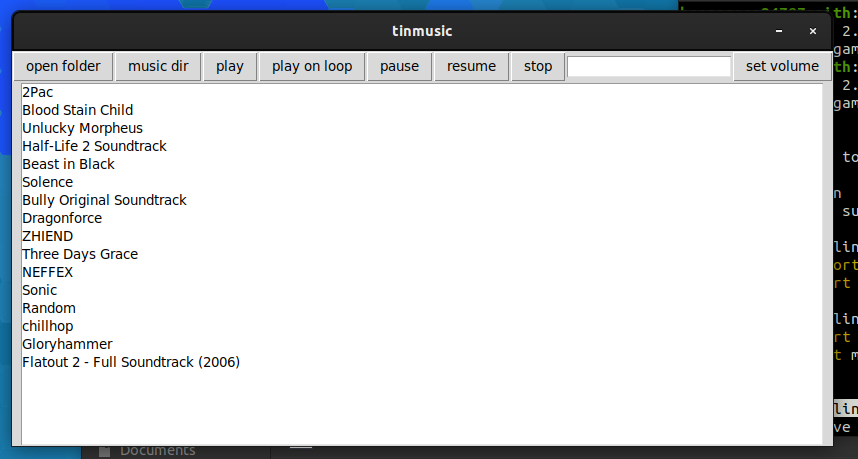

tinmusic.py
===
|name|version|state|
|:---:|:---:|:---:|
|tinmusic.py|devduild_alpha_0.0.1|testing|

States explained

* stable - fully working release
* unstable - somewhat working, with a few bugs
* testing - developing and testing new features

Screen



Dependencies
```bash
sudo apt install python3-tk python3-dev python3
python3 -m pip install pygame
```
To run
```bash
python3 tinmusic.py
```

Features

Current
* play and pause
* volume control
* play files from directory
* directory navigation

Supported files (more will not be added)
* wav

#Bugs
* Emotes cause app to crash if present in file name
